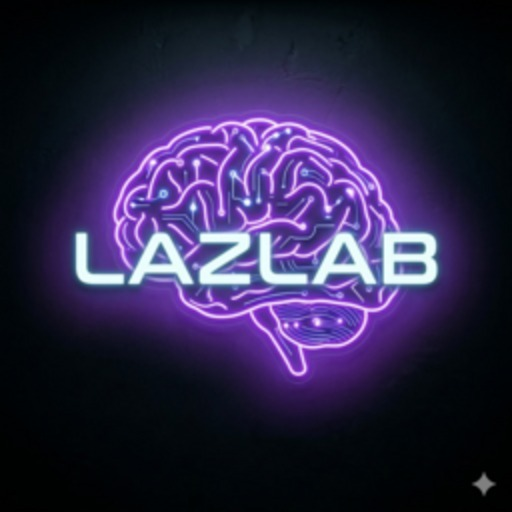
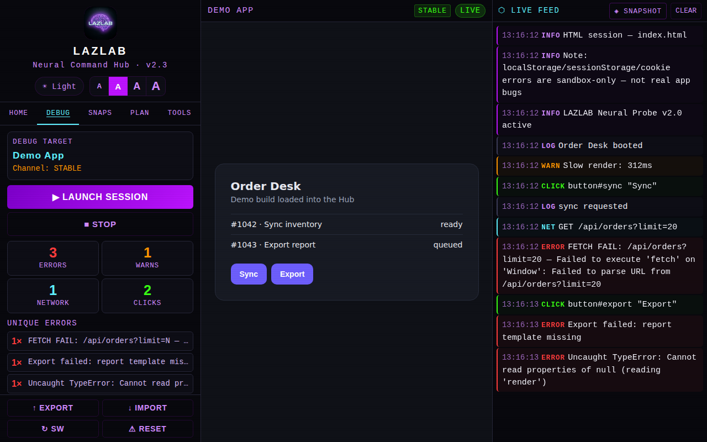
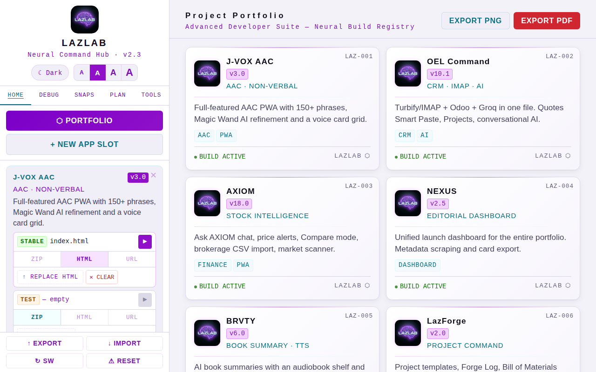

<div align="center">



# LAZLAB Hub

### Where every experiment gets wired.

**Load a build. Watch it break. Fix it faster.**<br>
The command bench for single-file web apps — installable, offline-ready, and entirely yours.


**[▶ Launch the Hub](https://johnlaz.github.io/lazlab/app/)** &nbsp;·&nbsp; **[The Studio](https://johnlaz.github.io/lazlab/)**

<br>



</div>

---

## Why it exists

Shipping lots of small apps means debugging lots of small apps. Browser DevTools are built for one tab; your portfolio is
a drawer full of them. **LAZLAB Hub is the bench you drop each build onto** — it runs it in a sandbox, listens to everything
it does, and tells you what went wrong, in a form you can paste straight into your AI of choice.

No servers. No accounts. No installers. One file, one tap, and it lives on your home screen.

## What's on the bench

| | |
|---|---|
| **🔌 App slots** | Register each product once. Every slot has a **Stable** and a **Test** channel, so you can debug the new build without touching the shipping one. Promote Test → Stable when it earns it. |
| **📦 Load it any way** | Drop in a **ZIP**, a single **HTML** file, or point at a live **URL**. |
| **🛰 Live debug sessions** | A probe is injected into your build and streams **console output, network calls, clicks and uncaught errors** into a live feed. Flag the lines that matter. |
| **🧬 Error fingerprints** | Identical errors collapse into one row with a count, so a loop that fires 400 times doesn't bury the one error that started it. |
| **✦ AI triage** | One tap sends the session to **Groq** and returns a one-line summary, likely root causes, the click path that triggered them, and concrete fixes. |
| **⬡ Send to Claude** | Packages the whole session — fingerprints, flagged events, recent log — as a clean report on your clipboard. Paste it anywhere. |
| **🧰 Power tools** | Auto-Crawler (clicks every interactive element), Record &amp; Replay scripts, a Console REPL inside the running build, DOM snapshots, Error Diff between two sessions, and a one-button Test Suite. |
| **🗂 Snapshots** | Save a session, come back next week, compare. |
| **🖼 Portfolio view** | Every slot as a card. Export the whole wall as a **PNG** or a branded **PDF**. |
| **🧠 Plan tab** | Dump raw notes, hit **AI Clean**, get a structured roadmap. |
| **🌗 Made to be read** | Light and dark themes, four text sizes, high-contrast labels, big tap targets. |

<div align="center">

</div>

## Install it (10 seconds)

The Hub is a real installable app — its own icon, its own window, works with no connection.

| Where | How |
|---|---|
| **Chrome / Edge** (desktop) | Open the [Hub](https://johnlaz.github.io/lazlab/app/) → click the install icon in the address bar, or tap **⬇ Install** inside the app. |
| **Android** (Chrome) | Tap **⬇ Install** inside the Hub, or **⋮ → Install app**. |
| **iPhone / iPad** (Safari) | **Share → Add to Home Screen**. The in-app **⬇ Install** button shows these steps. |

Once installed, the **App Mode** light on the home screen reads **Installed app · offline ready**. Long-press the icon for
shortcuts straight to **Portfolio** and **Debug**.

> The Hub and the Studio site are two separate installable apps. Install **LAZLAB Hub** from `/app/` for the tool.
> The site at the root is the studio's front door.

## Quick start

1. **Add a slot** — tap **+ New App Slot**, name it, and load a ZIP, HTML file or URL on the Stable or Test channel.
2. **Set the target and launch** — hit ▶ on the channel, open the **Debug** tab, tap **Launch Session**.
3. **Use the app like a user would.** Errors, warnings, requests and clicks stream in live. Tap **Triage Session with Groq**
   or **Send to Claude** when something looks off.

## AI, on your terms

- **Bring your own Groq key.** Paste it in **Plan → Groq API Key**. It's stored in your browser and sent only to `api.groq.com`.
- **The model picker keeps itself current.** The Hub asks Groq which chat models *your key* can use, lists the newest, and
  remembers your pick. If a model is ever retired, it re-pulls the list and retries once on a replacement.
- **Nothing is simulated.** If there's no key, the AI buttons say so. They don't fake an answer.

## Local-first, really

Everything — slots, notes, snapshots, your key — lives in your browser's `localStorage`. There is no backend and no account.
**Export** writes it all to a JSON file; **Import** restores it on another device.

The only network calls the Hub makes are to its own host, to `api.groq.com` (when you use AI), to the CDN that serves
JSZip / html2canvas / jsPDF, and to Google Fonts. The service worker caches those libraries so ZIP loading and PDF export
keep working offline.

> **Good to know:** ZIP builds are held in memory (they're too big for `localStorage`), so re-load a ZIP after fully closing
> the app. HTML and URL slots persist.

## Under the hood

```
lazlab/
├─ index.html              the Studio site
├─ manifest.webmanifest    Studio PWA manifest   (id /lazlab/)
├─ sw.js                   Studio service worker (scope /lazlab/)
├─ assets/  icons/         logos and Studio icons
└─ app/                    ← the Hub
   ├─ index.html           the whole app: HTML, CSS and vanilla JS in one file
   ├─ manifest.webmanifest Hub PWA manifest      (id /lazlab/app/, scope /lazlab/app/)
   ├─ sw.js                Hub service worker    (scope /lazlab/app/)
   ├─ icons/               192 / 512, maskable, Apple touch icon
   └─ screenshots/         used by the install dialog and this README
```

**How the offline layer behaves**

| Request | Strategy |
|---|---|
| The page (navigations) | Network-first with a 4 s budget, then the cached copy — online users always get your latest deploy. |
| Icons, manifest | Stale-while-revalidate. |
| JSZip, html2canvas, jsPDF, Google Fonts | Pre-cached, then stale-while-revalidate. |
| `api.groq.com`, URL debug sessions, anything else | Untouched. |

The two service workers never overlap: the Studio's ignores `/app/`, and each only deletes caches it created
(`lazlab-site-*` and `lazlab-hub-*`) — important, because every app on `johnlaz.github.io` shares one origin and one cache store.

## Shipping an update

1. Edit `app/index.html` (and bump `APP_VER` in it).
2. Bump `VERSION` in `app/sw.js` (`lazlab-hub-v…`).
3. Push to `main`. GitHub Pages publishes in about a minute; installed copies update on their next launch.

Same for the site: edit `index.html`, bump `VERSION` in `sw.js`.

## The studio

**LAZLAB** is an independent studio in Orlando, FL — one developer, single-file PWAs, real APIs only.
Building something in the same key? **[lazlab.io@gmail.com](mailto:lazlab.io@gmail.com)**

<div align="center"><sub>A <b>LAZLAB</b> creation · built in one file</sub></div>
